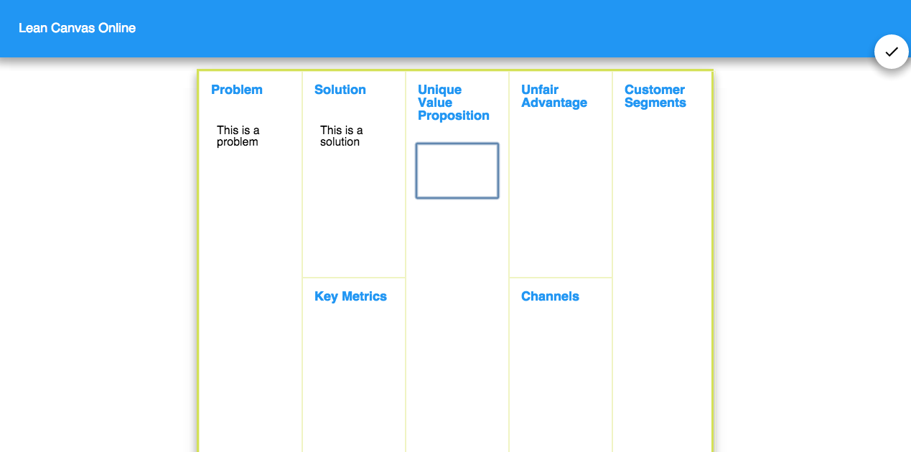

# Lean Canvas Online



## 目的

「Lean Canvas」を「HTML5/CSS3/JS」でつくろうというチュートリアルです。このサンプルコードでは、以下を目的としています。

- (主眼) HTML5のLocalStorageを学ぶ
- (サブ) HTMLの`contenteditable`属性について学ぶ
- (サブ) CSS3のResponsive DesignでWeb アプリを書く

## 対象

- HTML5/CSS3を習いたてたばかり！
- LocalStorageについて知りたい！

## About

> This is a lightweight web app to create Lean Canvas Online.

- [Demo Page](http://kenju.github.io/LeanCanvasOnline/)
- [Github repo](https://github.com/KENJU/LeanCanvasOnline)

# LocalStorageとは

LocalStorageを使うことによって、クライアント側にデータを保存することができます。
なお、クライアント側で改ざんできることから、セキュリティを懸念する必要があり、
またパスワードのような秘密性の高いデータは保存するべきではないです。

しかし、簡単なデータを一時的に保存したりするような場合には非常に便利なAPIで、
また用い方も簡単です。

## 参考リンク
- [チームラボ オンラインスキルアップ課題 - STEP1-6.ローカルストレージを使ってみる](http://team-lab.github.io/skillup-nodejs/1/6.html)
- [ブラウザでストレージ？ Web Storageを使いこなそう (1/3)](http://www.atmarkit.co.jp/ait/articles/1108/12/news093.html)
- [LocalStorageをもっとデータベースライクに使う方法](http://qiita.com/masamitsu-konya/items/ce7f6469434076448238)

# サンプルコード

## JS
まずは本題のJavaScriptから。

### まずは名前空間

```js

app = {};

app.initializeCanvasItems = function(){
	//add eventlistenr of blur for each canvas boxes
};
app.addEventListenerToClassnames = function(classnames){
	//generic code for adding event listner for classnames
};
app.setToLocalStorage = function(key, value){
	//generic code for setting key/value to localStorage
};
app.getFromLocalStorage = function(key){
	//generic code for getting value from localStorage
};
app.clearLocalStorage = function(){
	//clean all key/values in localStorage
};
window.onload = function(){
	//called when document is loaded
}

```

### LocalStorageから

```js

//generic code for setting key/value to localStorage
app.setToLocalStorage = function(key, value){
	if(localStorage){
		localStorage.setItem(key, value);
	}
};
//generic code for getting value from localStorage
app.getFromLocalStorage = function(key){
	if(localStorage){
		return localStorage.getItem(key);
	}
};
app.clearLocalStorage = function(){
	if(localStorage){
		localStorage.clear();
	}
};

```

### 初期化系

```js

app = {};
//add eventlistenr of blur for each canvas boxes
app.initializeCanvasItems = function(){
	var classnames = document.getElementsByClassName('canvas-item');
	app.addEventListenerToClassnames(classnames);

	for(var i = 0, len = classnames.length; i < len; i++){
		var classname = classnames[i];
		var key = classname.id;
		var value = app.getFromLocalStorage(key);
		classname.innerText = value;
	}
};
//generic code for adding event listner for classnames
app.addEventListenerToClassnames = function(classnames){
	for(var i = 0, len = classnames.length; i < len; i++){
		classnames[i].addEventListener('blur', function(){
			var key = this.id;
			var value = this.innerText;
			app.setToLocalStorage(key, value);
		});
	}
};

// ...localStorage系メソッド

window.onload = function(){
	app.initializeCanvasItems();
}


```

## HTML

ポイントは、それぞれのアイテムの`<div>`タグに`contenteditable="true"`属性が付いていることです。
これによって、タグ内の文字列を自由に改編することができます。

```html

<header>
	<h1>Lean Canvas Online</h1>
</header>
<main>
	<div id="canvas">
		<div class="canvas-box" id="canvas_problem_box">
			<h2>Problem</h2>
			<div class="canvas-item" id="canvas_problem" contenteditable="true"></div>
		</div>
		<div class="canvas-box" id="canvas_solution_box">
			<h2>Solution</h2>
			<div class="canvas-item" id="canvas_solution" contenteditable="true"></div>	
		</div>
		<div class="canvas-box" id="canvas_key_metrics_box">
			<h2>Key Metrics</h2>
			<div class="canvas-item" id="canvas_key_metrics" contenteditable="true"></div>			
		</div>
		<div class="canvas-box" id="canvas_uvp_box">
			<h2>Unique Value Proposition</h2>
			<div class="canvas-item" id="canvas_uvp" contenteditable="true"></div>		
		</div>
		<div class="canvas-box" id="canvas_unfair_advantage_box">
			<h2>Unfair Advantage</h2>
			<div class="canvas-item" id="canvas_unfair_advantage" contenteditable="true"></div>		
		</div>
		<div class="canvas-box" id="canvas_channels_box">
			<h2>Channels</h2>
			<div class="canvas-item" id="canvas_channels" contenteditable="true"></div>		
		</div>
		<div class="canvas-box" id="canvas_customer_segments_box">
			<h2>Customer Segments</h2>
			<div class="canvas-item" id="canvas_customer_segments" contenteditable="true"></div>
		</div>
		<div class="canvas-box" id="canvas_cost_box">
			<h2>Cost Structure</h2>
			<div class="canvas-item" id="canvas_cost" contenteditable="true"></div>
		</div>
		<div class="canvas-box" id="canvas_revenue_box">
			<h2>Revenue Streams</h2>
			<div class="canvas-item" id="canvas_revenue" contenteditable="true"></div>		
		</div>
	</div>
</main>
<footer>
	...
</footer>

</body>

```

## SCSS

### モバイル用(幅が800px以下)

大事なところだけ。

```scss

#canvas {
	display:flex;
	display: -webkit-flex;
	-webkit-flex-direction:column;
	flex-direction:column;
	h2 {
		font-size: $font-size-large;
		color: $blue-500;
		padding: 1rem;
		font-weight: bold;
	}
	.canvas-box{
		box-shadow: $box-shadow;
		width:88vw;
		-webkit-align-self:center;
		align-self:center;
		margin: 2rem 0;		
	}
	.canvas-item {
		border-left: 3px solid $lime-100;
		margin: 1rem;
		padding: .5rem;
		padding-bottom: 3rem;
	}
}

```

### PC画面用(幅が800px以上)

ポイントは、SCSSを使っているので、
それぞれのアイテムを計算で出力している点です。

```scss

@media (min-width: 800px){
	$canvas-width: 720px;
	$canvas-height: 720px;
	#canvas {
		position: relative;
		width: $canvas-width;
		height: $canvas-height;
		margin: 1rem auto;
		border: 3px solid $lime-400;
		padding:0;
		display:block;
		box-shadow: $box-shadow;
		.canvas-box {
			position: absolute;
			border:1px solid $lime-100;
			margin:0;
			box-shadow:none;
		}
		.canvas-item {
			border: none;
		}
		#canvas_problem_box{
			width:$canvas-width * 1/5;
			height:$canvas-height * 4/5; 
			top:0;
			left:0;
			animation: slideinFromLeft .2s .8s both; 
		}
		#canvas_solution_box{ 
			width:$canvas-width * 1/5;
			height:$canvas-height * 2/5;
			top:0;
			left:$canvas-width * 1/5;
			animation: slideinFromLeft .2s .9s both; 
		}
		#canvas_key_metrics_box{ 
			width:$canvas-width * 1/5;
			height:$canvas-height * 2/5;
			top:$canvas-height * 2/5;
			left:$canvas-width * 1/5;
			animation: slideinFromLeft .2s 1.0s both; 
		}
		#canvas_uvp_box{ 
			width:$canvas-width * 1/5;
			height:$canvas-height * 4/5;
			top:0;
			left:$canvas-width * 2/5;
			animation: slideinFromLeft .2s 1.1s both; 
		}
		#canvas_unfair_advantage_box{ 
			width:$canvas-width * 1/5;
			height:$canvas-height * 2/5;
			top:0;
			left:$canvas-width * 3/5;
			animation: slideinFromLeft .2s 1.2s both; 
		}
		#canvas_channels_box{
			width:$canvas-width * 1/5;
			height:$canvas-height * 2/5;
			top:$canvas-height * 2/5;
			left:$canvas-width * 3/5;
			animation: slideinFromLeft .2s 1.3s both; 
		}
		#canvas_customer_segments_box{ 
			width:$canvas-width * 1/5;
			height:$canvas-height * 4/5;
			top:0;
			left:$canvas-width * 4/5;
			animation: slideinFromLeft .2s 1.4s both; 
		}
		#canvas_cost_box{ 
			width:$canvas-width * 1/2;
			height:$canvas-height * 1/5;
			top:$canvas-height * 4/5;
			left:0;
			animation: slideinFromLeft .2s 1.5s both; 
		}
		#canvas_revenue_box{ 
			width:$canvas-width * 1/2;
			height:$canvas-height * 1/5;
			top:$canvas-height * 4/5;
			left:$canvas-width * 1/2;
			animation: slideinFromLeft .2s 1.6s both; 
		}
	}
}

```


## Copyright

Created by and copyright Kenju Wagatsuma Released under the [MIT license](https://github.com/KENJU/LeanCanvasOnline/blob/master/LICENSE).